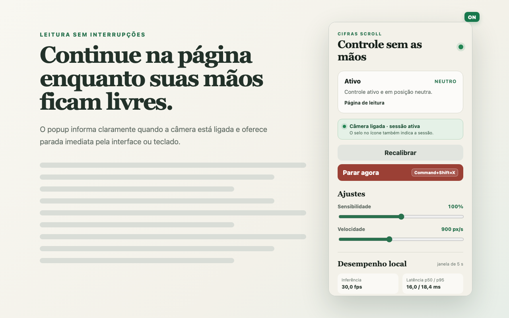

# Cifras Scroll

**Role páginas no Chrome com movimentos da cabeça e mantenha as mãos livres.**

Feito inicialmente para ler cifras enquanto você canta e toca, o Cifras Scroll também pode controlar a rolagem de outras páginas compatíveis. A câmera estima movimentos verticais da cabeça, e uma posição neutra calibrada a cada sessão permite parar a rolagem sem usar as mãos.

**[Instalar pela Chrome Web Store](https://chromewebstore.google.com/detail/cifras-scroll/onkimagjeggfnamedjbodeihfedkmdba)** · [Primeiros passos](docs/INSTALLATION.md) · [Suporte](SUPPORT.md) · [Privacidade](PRIVACY.md)

## Como usar

Você precisa do **Google Chrome 116 ou superior no computador** e de uma câmera. Para usar a versão da loja, basta instalar a extensão; nenhuma ferramenta de desenvolvimento é necessária.

1. Instale pela Chrome Web Store e fixe o ícone do Cifras Scroll na barra do navegador.
2. Na configuração inicial, clique em **Autorizar câmera**. A verificação solicita somente vídeo e libera a câmera em seguida.
3. Abra uma página de cifra ou leitura com endereço `http` ou `https`, abra a extensão e clique em **Ativar nesta aba**.
4. Mantenha uma postura confortável durante a calibração. Depois, incline a cabeça verticalmente para rolar para cima ou para baixo; volte ao neutro para interromper o movimento.
5. Ajuste **Sensibilidade** e **Velocidade** conforme necessário. Use **Recalibrar** se mudar de postura ou posição da câmera.
6. Para encerrar e liberar a câmera, clique em **Parar agora** ou use o atalho sugerido `Alt+Shift+X` (`Command+Shift+X` no macOS).

O popup pode ser fechado durante o uso. O selo **ON** indica sessão em uso; **PAUS** indica rolagem pausada **com a câmera ainda ligada**. Ao perder a face, o controle pausa e exige **Retomar**. Consulte ou altere o atalho em `chrome://extensions/shortcuts`, pois ele pode conflitar com outra combinação.



## Privacidade

- Todo o processamento de câmera acontece no dispositivo, com modelo e arquivos de inferência incluídos na extensão.
- Vídeo, imagens e frames não são gravados, armazenados nem enviados.
- Nenhum áudio é solicitado e não há reconhecimento de identidade.
- Não há backend, contas, anúncios ou telemetria.
- Somente sensibilidade e velocidade são salvas localmente. Calibração, pose, estado da sessão e métricas ficam em memória.
- O acesso à página é temporário, após ativação explícita, sem permissões permanentes para todos os sites.

As permissões são `activeTab` (aba escolhida), `scripting` (aplicar a rolagem), `storage` (preferências locais) e `offscreen` (processamento com o popup fechado). Veja a [política de privacidade completa](PRIVACY.md).

## Compatibilidade e limites

- Cada sessão controla uma aba. Trocar de aba ou de janela do Chrome, navegar, recarregar ou fechar a aba encerra a sessão; ative novamente quando quiser continuar.
- Páginas internas do Chrome, a Chrome Web Store e o visualizador interno de PDF não aceitam o controle.
- A extensão atua na rolagem principal da página. Containers internos, iframes e leitores com rolagem personalizada podem não funcionar.
- Iluminação, enquadramento, câmera e capacidade do computador influenciam a experiência.
- Outros navegadores e dispositivos móveis não fazem parte do suporte atual.

Veja as [limitações conhecidas](docs/KNOWN_LIMITATIONS.md) e as [soluções para problemas comuns](docs/INSTALLATION.md#problemas-comuns).

## Estado do projeto

A versão `1.0.0` está publicada na [Chrome Web Store](https://chromewebstore.google.com/detail/cifras-scroll/onkimagjeggfnamedjbodeihfedkmdba), e as cinco fases do MVP estão concluídas e aprovadas. Em 4 de outubro de 2026, o responsável informou que testou a extensão com dois amigos e que funcionou.

Esse relato é uma validação inicial de uso, sem métricas detalhadas ou configurações dos equipamentos. A medição de CPU total e a validação documentada em um segundo hardware continuam pendentes. O histórico de evidências está no [protocolo de testes](docs/TEST_PROTOCOL.md).

## Problemas, dúvidas e sugestões

Abra uma [issue no GitHub](https://github.com/glaysonbsantos/cifras-scroll/issues) com os passos para reproduzir, versão da extensão, Chrome, sistema operacional e estado mostrado no popup. Não inclua imagens da câmera, vídeos, dados pessoais ou endereços privados. O [guia de suporte](SUPPORT.md) detalha o que informar.

## Desenvolvimento

Pré-requisitos: **Node.js 22.12+ na linha 22 ou Node.js 24** e **pnpm**. Esta revisão foi verificada com Node.js 24.16.0 e pnpm 11.3.0. Node.js 20 não atende às ferramentas atuais do projeto.

```bash
git clone --branch main https://github.com/glaysonbsantos/cifras-scroll.git
cd cifras-scroll
pnpm install --frozen-lockfile
pnpm dev
```

O WXT gera a extensão de desenvolvimento em `.output/chrome-mv3-dev`. Carregue esse diretório em `chrome://extensions` com **Modo do desenvolvedor** ativo. Para instalar uma build local de produção, siga a [instalação descompactada](docs/INSTALLATION.md#instalação-local-para-desenvolvimento).

| Comando | Finalidade |
|---|---|
| `pnpm dev` | Desenvolvimento com WXT |
| `pnpm test` | Testes automatizados sem câmera |
| `pnpm build` | Verificação TypeScript e build em `.output/chrome-mv3` |
| `pnpm check` | Testes, verificação TypeScript e build de produção |
| `pnpm zip` | Verificação TypeScript e ZIP de distribuição |
| `pnpm release` | Testes, geração do ZIP e auditoria do pacote |

O ZIP gerado fica em `.output/cifras-scroll-<versão>-chrome.zip`. Os testes automatizados não substituem a validação com pessoa e câmera.

### Organização do código

- `src/core`: pose, calibração, interpretação de gestos e métricas, sem APIs da extensão.
- `src/vision`: câmera e detector local MediaPipe Face Landmarker.
- `src/extension`: mensagens, preferências e regras de sessão.
- `src/entrypoints`: popup, onboarding, service worker, documento offscreen e controlador da página.
- `src/web`: aplicação da rolagem baseada em tempo.
- `public/mediapipe`: modelo e WASM locais, com origem e hashes documentados.

O service worker coordena a sessão; câmera e inferência ficam no documento offscreen. Frames não atravessam a mensageria da extensão. Veja o [guia de contribuição](CONTRIBUTING.md) antes de propor mudanças.

## Documentação do projeto

- [Plano e progresso do MVP](docs/MVP_PLAN.md)
- [Protocolo e resultados de testes](docs/TEST_PROTOCOL.md)
- [Decisões técnicas](docs/DECISIONS.md)
- [Checklist de validação manual](docs/FINAL_CHECKLIST.md)
- [Distribuição e atualizações na Chrome Web Store](docs/CHROME_WEB_STORE_RELEASE.md)
- [Origem dos assets do MediaPipe](public/mediapipe/README.md)
- [Instruções para agentes](AGENTS.md)

## Licença

O código próprio do Cifras Scroll está disponível sob a [licença MIT](LICENSE), permitindo uso, modificação e redistribuição com preservação do aviso de autoria e da licença. As dependências e os assets de terceiros seguem suas respectivas licenças; veja as [referências de terceiros](THIRD_PARTY_NOTICES.md) e a [origem dos assets do MediaPipe](public/mediapipe/README.md).
